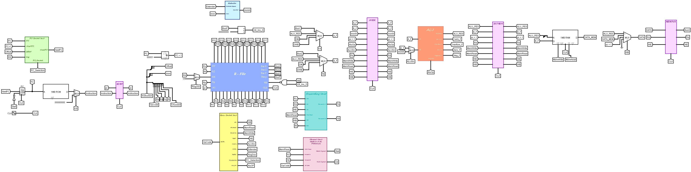

# Pipelined RISC Processor Design
This project implements a Pipelined RISC Processor using Verilog, Where multipule instructions are executed in Parallel across diggerent pipeline stages. 
Full explanation is available in the project report: [Project Report](Arch-Project2-Report.pdf).

## Table of Contents:
1. [Overview](#overview)
2. [Objectives](#objectives)
3. [Pipeline Architecture](#PipelineArchitecture)
4. [Project Files](#ProjectFiles)
5. [Datapath](#Datapath)
6. [Control Unit](#ControlUnit)
7. [Simulation](#Simulation)
8. [How to Use](#HowtoUse)

## Overview
This project demonstrates the design of a pipelined processor, which improves performance by executing multiple instructions simultaneously using different stages of execuation.

## Objectives
- **Design** a 32-bit pipelined CPU using verilog.
- **Implement** and simulate code sequences to verify the functionality of the processor, datapath and control unit.
- **Write** a testbench to test the processor’s operations.
- **Improve** performance by using pipelining.
- **Verify** functionality using simulation.

## Pipeline Architecture
The processor is divided into the following stages:
1. **IF** --> Instruction Fetch
2. **ID** --> Instruction Decode
3. **EX** --> Execute
4. **MEM** --> Memory Access
5. **WB** --> Write Back

## Project Files
- **MainVerilog.v** --> Main Verilog implementation
- **DataPath.circ** --> Datapth design
- **Arch-Project2-Report.pdf** --> Project report
- **Main Control Signals (2).txt** --> Control signals analysis
- **wave.asdb** --> Simulation waveform of main project

## Datapath

## Control Unit
The Control Unit is responsible for generating signals for each pipeline stage.

## Simulation
Simulation results are available in: wave.asdb

## How to Use
**Run** the Code
- **Use** a simulator such as:
- **ModelSim**
- **Vivado**

**Open** Datapath
- **Use** Logisim to open: DataPath.circ

**Read** the Report
- **Open** : Arch-Project2-Report.pdf

## Notes
1. This Project is for educational purposes
2. The design include hazard detection and forwarding

## Acknoledgments
This project was developed as part of a computer Arcitecture course.

